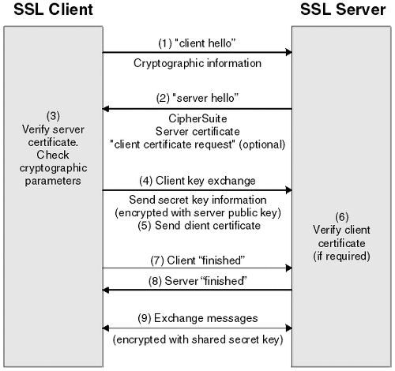

## ☀ TLS/SSL 프로토콜

> TLS (Transport Layer Security)와 그 이전 버전인 SSL (Secure Sockets Layer)은 **인터넷 상에서 데이터를 안전하게 전송하기 위한 프로토콜**이다. 둘 다 암호화된 연결을 제공하며, 클라이언트와 서버 간의 통신을 보호한다.
> 
- OSI 7계층 모델을 기준으로 볼 때, TLS/SSL은 주로 **세션 계층**과 **전송 계층** 사이에서 동작한다. TCP/IP 모델에서 볼 때는 **전송 계층**에 가깝게 위치한다.
    
    → TLS/SSL은 전송 계층과 세션 계층 사이에서 동작하여 데이터의 안전한 전송을 보장하는 프로토콜
    
- HTTP를 예로 들면, HTTP는 어플리케이션 계층에서 동작하고, TCP는 전송 계층에서 동작합니다. HTTPS(즉, HTTP over TLS)를 사용할 때, TLS는 HTTP와 TCP 사이에서 동작하게 된다. 이것은 TLS가 HTTP 메시지를 암호화하고, 그 후에 암호화된 메시지가 TCP를 통해 전송된다는 것을 의미한다.

### SSL (Secure Sockets Layer)

Netscape에 의해 1990년대 중반에 처음 개발된 보안 프로토콜입니다. SSL 3.0은 1996년에 발표되었으나, 이후의 보안 결함으로 인해 대체되었다.

### TLS (Transport Layer Security)

SSL 3.0의 후속 버전으로, 1999년에 IETF(Internet Engineering Task Force)에 의해 표준화되었다. TLS는 지속적인 업데이트를 거쳐 현재 가장 널리 사용되는 버전은 TLS 1.3이다.

### 역할

1. **인증**
    
    클라이언트는 서버의 인증서를 통해 서버의 정체성을 확인할 수 있다. 선택적으로, 서버 역시 클라이언트의 인증서를 통해 클라이언트를 인증할 수 있다.
    
2. **데이터의 무결성**
    
    데이터가 전송 중에 변경, 손상, 또는 변조되지 않았음을 보장한다.
    
3. **기밀성**
    
    클라이언트와 서버 간에 교환되는 데이터는 암호화되어, 중간자 공격 등의 공격자로부터 보호된다.
    
4. **포워드 시크릿**
    
    최근의 TLS 버전들은 세션마다 새로운 키를 생성하기 때문에 하나의 세션 키가 노출되더라도 다른 세션의 통신은 안전하다.
    
5. **확장성**
    
    TLS는 다양한 암호화 알고리즘 및 기법을 지원하기 위한 확장 구조를 가지고 있다.
    

### TLS/SSL 프로토콜이라고 부르는 이유

**사실 둘은 서로 다른 버전의 프로토콜이다.** SSL은 원래 Netscape에 의해 1990년대 초에 개발되었고, TLS는 그 후계로 IETF에 의해 개발되었다. TLS는 SSL 3.0의 후속 버전으로 생각할 수 있으며, 더 안전하고 효율적인 특징들을 가지고 있다.

그런데도 왜 TLS/SSL 이라고 자주 언급되는지에 대한 이유가 있다.

1. **역사적 배경**
    
    많은 사람들이 인터넷의 초기 시절부터 SSL을 사용해왔기 때문에 "SSL"이라는 용어가 널리 알려져 있다. 따라서, 많은 사람들이 SSL과 TLS를 동의어로 사용하게 되었다.
    
2. **호환성**
    
    초기 TLS 버전은 SSL 3.0과 호환성을 유지하기 위해 설계되었다. **이로 인해 많은 시스템에서는 SSL과 TLS를 모두 지원하기도 했다.**
    
3. **일반적인 사용**
    
    인터넷 보안에 대한 대중적인 인식이 확산되면서 **"SSL"이라는 용어가 "암호화된 연결"이나 "보안 연결"을 의미하는 일반적인 용어로 사용되게 되었다.** 따라서, 많은 사람들이 "SSL 인증서"나 "SSL 암호화" 같은 용어를 사용하게 되었다.
    

⇒ 최근에는 많은 조직과 전문가들이 SSL을 완전히 폐기하고 TLS만 사용하도록 권장하고 있다. 그러나, 용어의 사용 습관이나 인식 때문에 "TLS/SSL"이라는 표현이 여전히 흔하게 사용된다. 하지만 기술적으로 정확하게 표현하려면 "TLS"를 사용하는 것이 좋다.

## ☀ TLS/SLL Handshake

1. **사용자 브라우저 접속**
    
    사용자가 웹 브라우저를 통해 A서버에 *https://* URL 형식으로 접속을 시도한다.
    
2. **인증서 요청과 전달**
    
    브라우저는 서버의 SSL 인증서를 요청한다. 서버는 전자 서명된 인증서를 클라이언트에게 전송한다.
    
3. **인증서의 검증**
    
    클라이언트의 브라우저는 이미 내장된 CA의 공개키로 인증서를 복호화한다. 이를 통해 서버의 공개키를 얻는다.
    
4. **`pre-master-key`의 생성 및 전송**
    - 클라이언트는 랜덤한 값를 생성하여 `pre-master-key`를 만든다. 이 값은 나중에 세션 키를 도출하기 위한 원본이 된다.
    - 클라이언트는 서버의 공개키(서버의 인증서에 포함되어 있음)를 사용하여 pre-master secret를 암호화하고, 이 암호화된 값을 서버에 전송한다.
5. **(클라이언트 인증서)**
    
    만약 서버가 클라이언트 인증서를 함께 요구했다면, 클라이언트의 인증서와 클라이언트의 개인키로 암호화된 임의의 바이트 문자열을 함께 보내준다.
    
6. `**pre-master secret`의 수신 및 복호화**
    
    서버는 (클라이언트의 인증서를 확인 후) 자신의 개인키를 사용하여 클라이언트로부터 받은 암호화된 pre-master secret를 복호화한다. 이로써, 서버와 클라이언트 모두 동일한 pre-master secret 값을 가지게 된다.
    
7. **대칭키 생성**
    
    이제 클라이언트와 서버는 각자 pre-master secret와 함께 핸드쉐이크 과정에서 교환된 다른 랜덤한 값들 (예: 클라이언트 랜덤, 서버 랜덤)을 결합하여 **실제 세션 키를 생성한다**. **이렇게 생성된 세션 키는 대칭키 암호화에 사용된다.**
    
8. **대칭키 확인**
    - 핸드쉐이크 과정에서 교환된 모든 메시지의 무결성을 확인하기 위한 과정
    - 클라이언트는 handshake 과정이 완료되었다는 `finished` 메시지를 서버에 보내면서, 지금까지 보낸 교환 내역들을 해싱 후 그 값을 대칭키로 암호화하여 같이 담아 보내준다.
    - 서버도 동일하게 교환 내용들을 해싱한 뒤 클라이언트에서 보내준 값과 일치하는 지 확인한다. 일치하면 서버도 마찬가지로 `finished` 메시지를 이번에 만든 대칭키로 암호화하여 보낸다.
9. **암호화된 통신의 시작**
    
    클라이언트와 서버가 세션 키를 확보한 후, 이 키를 사용하여 모든 메시지를 암호화 및 복호화하며 안전하게 통신한다.
    

⇒ **하이브리드 방식** 사용

- 비대칭키(공개키) 방식
    
    핸드쉐이크 과정에서 클라이언트는 서버의 공개키로 데이터를 암호화해서 전송. 서버는 자신의 개인키를 사용하여 데이터를 복호화 → 이렇게 해서 둘 사이에 안전하게 통신하면서 공유할 대칭키를 결정하게 된다.
    
- 대칭키 방식
    
    한번 핸드쉐이크가 완료되면, 서버와 클라이언트는 교환된 정보를 기반으로 실제 세션 키를 생성한다. 이 세션 키는 대칭키로, 암호화와 복호화에 동일한 키가 사용된다. 이후 모든 통신은 이 대칭키를 사용해서 암호화되어 전송된다.
    

## ☀ 참고 자료

[SSL 인증서란 무엇인가요? - SSL/TLS 인증서 설명 - AWS](https://aws.amazon.com/ko/what-is/ssl-certificate/)

[[브라우저에 URL 입력 후 일어나는 일들] 5_TLS/SSL Handshake](https://wangin9.tistory.com/entry/브라우저에-URL-입력-후-일어나는-일들-5TLSSSL-Handshake)

[HTTP & HTTPS | 👨🏻‍💻 Tech Interview](https://gyoogle.dev/blog/computer-science/network/HTTP%20&%20HTTPS.html)