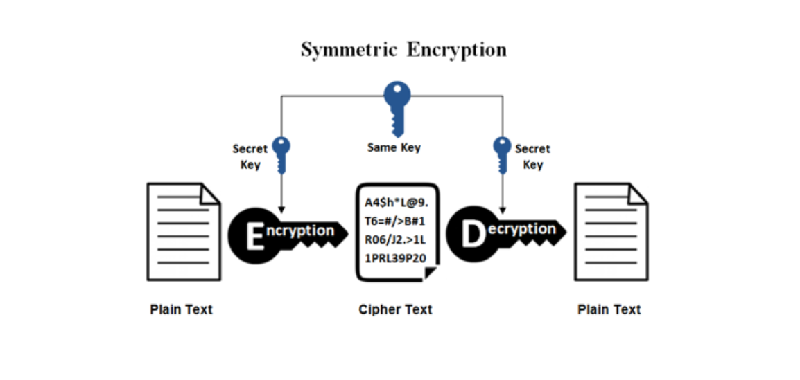
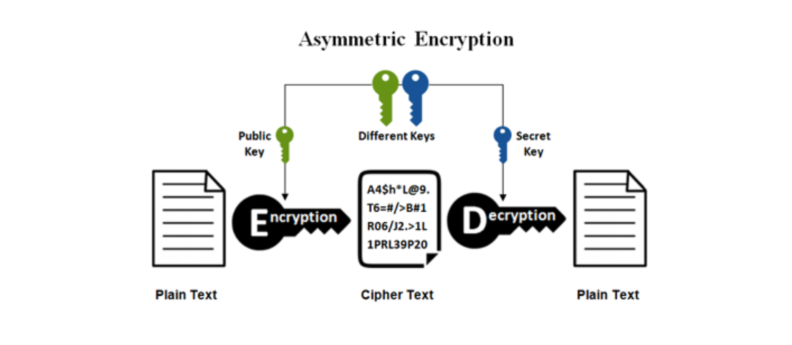
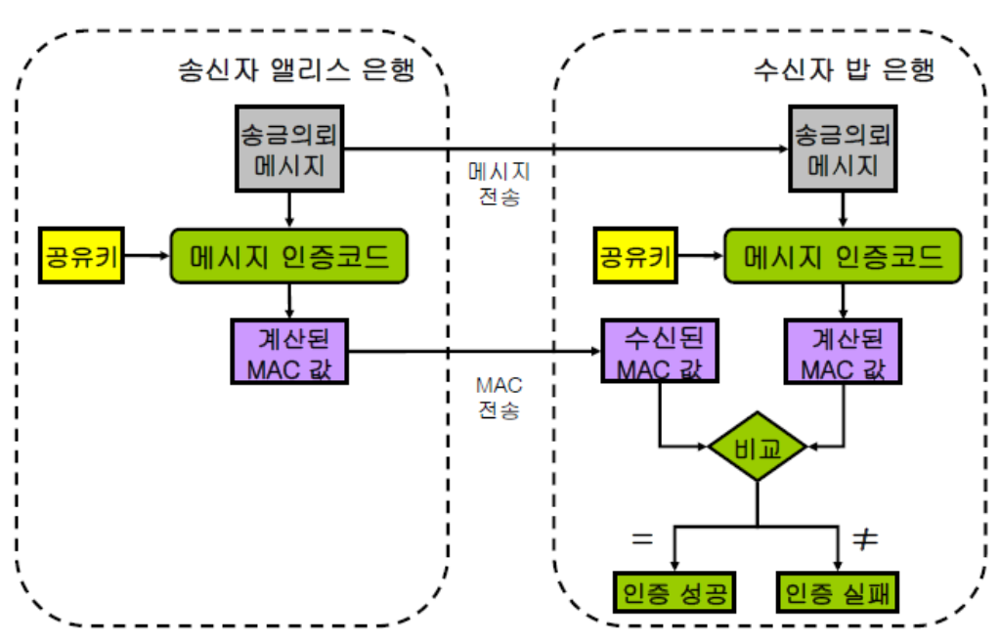
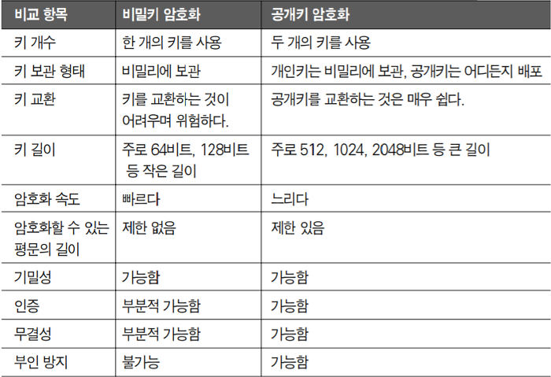
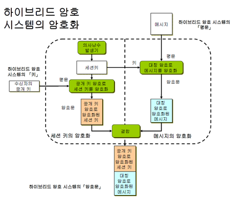
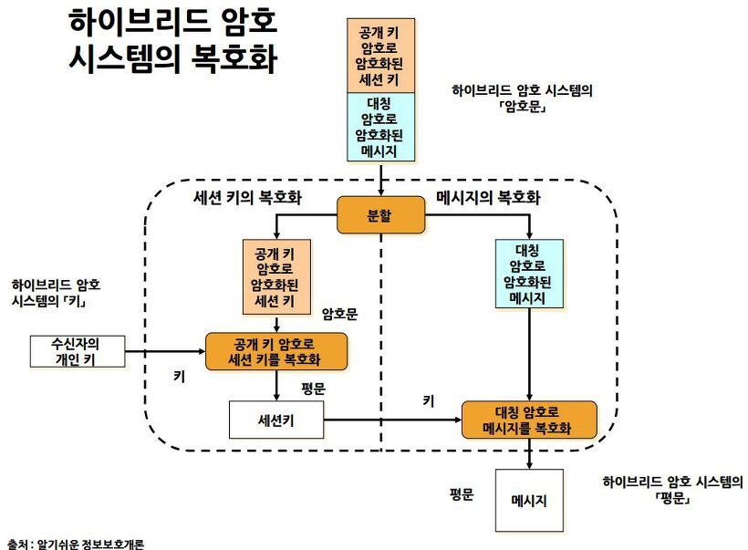

## ☀ 암호화

> 정보 보안의 핵심 요소 중 하나로, 데이터를 변형하여 원본을 알 수 없게 하는 과정을 의미
> 

이를 가능하게 하는 것이 암호화 알고리즘과 키이다. 대칭키와 공개키는 암호화의 두 주요 방법으로, 각기 다른 특성과 용도를 가지고 있다.

## ☀ 대칭키 암호화 ****(Symmetric Key)****

> 암호화와 복호화에 같은 암호키(대칭키)를 사용하는 알고리즘
> 

### 특징

- 단일 키 사용
    
    암호화와 복호화에 동일한 키를 사용한다.
    
    비밀키 하나만 알아내면 해독이 가능하다.
    
- 속도
    
    대칭키 암호화는 공개키 암호화에 비해 연산이 단순하여 속도가 빠르다.
    
- 키 관리
    
    대칭키 전달과정에서 보안 위험에 노출될 수 있다.
    
- **장점**
    - 속도가 빨라 대용량 Data 암호화에 적합하다.
- **단점**
    - 키를 교환해야 하는 문제가 있다.
    - 키 관리 어렵다.
    - 확장성 떨어진다.
    - 기밀성을 제공하나, 무결성/인증/부인방지 를 보장하지 않는다.

### **주요 알고리즘**

- DES (Data Encryption Standard)
- 3DES (Triple DES)
- AES (Advanced Encryption Standard)
- SEED
- ARIA
- MASK

## ☀ ****공개키/비밀키 암호화 (Public Key or Asymmetric Encryption)****

> 암호화와 복호화에 사용하는 암호키를 분리한 알고리즘
> 

대칭키 암호 방식과 비교하여 **비대칭** 암호라고 부른다. 대칭키의 키 분배 문제를 해결하기 위해 고안되었다.

 ⇒ 대칭키의 경우 송수신자만 키를 알아야하기 때문에 보안의 위험이 있지만, 공개키와 비밀키로 분리할 경우 공개키만 공개하면 된다.

### 특징

- 키 쌍
    
    서로 짝을 이루는 공개키(public key)와 개인키(private key) 두 개의 키가 존재한다.
    
    공개키로 암호화한 것은 개인키로만 복호화 가능, 개인키로 암호화된 것은 공개키로만 복호화 가능 ⇒ 서로가 서로를 해독
    
- 키 공개
    
    공개키는 모두에게 공개될 수 있으나, 개인키는 그 소유자만이 알 수 있다.
    
- 속도
    
    대칭키 암호화보다 복잡한 연산을 필요로 하므로 상대적으로 속도가 느리다.
    
- **장점**
    - 키 분배할 필요가 없다
    - 기밀성/인증/부인방지 기능 제공한다.
- **단점**
    - 속도가 느리다.

### **주요 알고리즘**

- Diffie Hellman : 최초의 공개키 알고리즘, 위조에 취약
- RSA : 대표적 공개키 알고리즘
- DSA : 전자서명 알고리즘 표준
- ECC : 짧은 키로 높은 암호 강도, 빠른 구현 가능 PDA, 스마트폰등에 사용

### **사용 예**

- 전자 서명**:** 송신자의 개인키로 메시지에 서명하면, 수신자는 송신자의 공개키를 사용하여 해당 서명을 검증할 수 있다.
- 암호화**:** 수신자의 공개키로 데이터를 암호화하면, 수신자만이 그의 개인키로 해당 데이터를 복호화할 수 있다.

### 공개키 암호화 방식 진행 과정

1. A가 웹 상에 공개된 'B의 공개키'를 이용해 평문을 암호화하여 B에게 보냄
2. B는 자신의 비밀키로 복호화한 평문을 확인, A의 공개키로 응답을 암호화하여 A에개 보냄
3. A는 자신의 비밀키로 암호화된 응답문을 복호화함

하지만 공개키(비대칭키) 암호화 방식만 사용할 경우, 데이터의 기밀성은 보장할 수 있지만, 데이터의 무결성과 진위는 보장할 수 없다.

→ 이는 MAC 방식이나 전자 서명으로 해결 가능

- MAC(Message Authentication Code)
    
    메시지와 비밀키를 사용하여 생성된 고정 길이의 값. 이 값을 메시지와 함께 보내면 수신자는 같은 비밀키를 사용해 MAC 값을 다시 계산하고, 전송된 MAC 값과 비교하여 메시지의 무결성을 검증할 수 있다.(대칭키 방식)

- 전자 서명(Digital Signature)
    
    메시지를 해싱(데이터를 고정된 크기의 값으로 변환하는 방법)하여 생성된 값에 개인키를 사용해 암호화한 것. 수신자는 송신자의 공개키를 사용하여 복호화하여 원본 메시지의 해시 값과 비교함으로써 메시지의 무결성 및 발신자의 인증을 동시에 검증할 수 있다.
    

## ☀ 대칭키와 공개키의 비교

## ☀ **하이브리드 방식**

> 속도와 키 관리 문제를 해결하기 위해 대칭키와 공개키로 암호화를 결합한 방식
> 

많은 현대 시스템에서는 두 방식을 적절히 결합하여 사용한다. 예를 들어, SSL/TLS에서는 이러한 하이브리드 방식을 사용하여 안전하게 통신한다.

### 하이브리드 방식 진행 과정

1. 키 교환**:** A와 B가 통신을 시작할 때, A는 B의 공개키로 대칭키를 암호화하여 전송한다.
2. 데이터 교환**:** B는 자신의 개인키로 복호화하여 대칭키를 획득한다.
3. A와 B는 앞으로 이 대칭키를 사용하여 데이터를 암호화/복호화하며 통신한다.

즉, 대칭키를 주고받을 때만 공개키 암호화 방식을 사용하고 이후에는 계속 대칭키 암호화 방식으로 통신한다.

## ☀ 참고 자료

[대칭키 & 공개키 | 👨🏻‍💻 Tech Interview](https://gyoogle.dev/blog/computer-science/network/%EB%8C%80%EC%B9%AD%ED%82%A4%20&%20%EA%B3%B5%EA%B0%9C%ED%82%A4.html)

[대칭키 vs 공개키(비대칭키)](https://velog.io/@gs0351/대칭키-vs-공개키비대칭키)

[하이브리드 암호시스템 (Hybrid cryptosystem)](https://skogkatt.tistory.com/entry/하이브리드-암호시스템-Hybrid-cryptosystem)